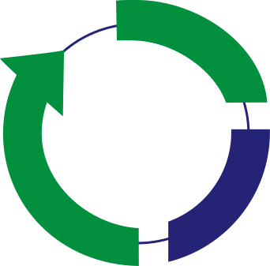

<p align="center">
  
</p>

<h1 align="center">Virchow RAG</h1>

<p align="center">
  Internal document retrieval. Upload PDFs, ask in plain English, get answers with source citations.<br/>
  Web UI plus native desktop apps for Mac and Windows.
</p>

<p align="center">
  <a href="https://github.com/Artechsolutions-arts/virchow_rag/releases/latest">
    
  </a>
  <a href="https://github.com/Artechsolutions-arts/virchow_rag/actions/workflows/deploy.yml">
    
  </a>
</p>

**Live install:** 14,263 PDFs ingested, ~78K chunks indexed. Mac Studio M3 Ultra at `192.168.10.99` on the office LAN.

---

## Table of contents

- [What it does](#what-it-does)
- [Architecture](#architecture)
- [For employees: installing the desktop app](#for-employees-installing-the-desktop-app)
- [For admins: hosting the server](#for-admins-hosting-the-server)
  - [Prerequisites](#prerequisites)
  - [Install](#install)
  - [Start services](#start-services)
- [Admin panel](#admin-panel)
- [CI/CD: auto-deploy on push](#cicd-auto-deploy-on-push)
- [Releasing a new desktop app version](#releasing-a-new-desktop-app-version)
- [Project layout](#project-layout)
- [Configuration reference](#configuration-reference)
- [Troubleshooting](#troubleshooting)

---

## What it does

1. **Ingest** — drop a PDF (or 100 of them). DotsOCR extracts text + layout, the chunker splits it into 600-token windows, and `qwen3-embedding:8b` embeds each chunk into a 4096-dim vector stored in pgvector.
2. **Retrieve** — when you ask a question, hybrid search (vector + keyword, alpha=0.6/beta=0.4) pulls the top 50 candidates, reranks to top 5.
3. **Answer** — an Ollama LLM (default `qwen2.5:14b-instruct`, swappable from the admin UI) composes a grounded answer with inline source citations. Each citation links to the original PDF page.
4. **Cite** — click any source filename in the chat. The PDF opens in a Claude-style right-side panel next to the answer.

Pipeline parameters are documented in [`PIPELINE_CONFIG.md`](./PIPELINE_CONFIG.md).

---

## Architecture

```
                           ┌─────────────────────────┐
        employee laptop ──▶│  Virchows Wiki app      │
   (Mac DMG or Win MSI)    │  (Pake/Tauri WebView)   │
                           │  - polls build-version  │
                           │    every 30s → live     │
                           │    auto-reload          │
                           └────────────┬────────────┘
                                        │ http://192.168.10.99:3000
                                        ▼
                           ┌─────────────────────────┐
                           │  Mac Studio (host)      │
                           │                         │
                           │  ┌───────────────────┐  │
                           │  │ Next.js web :3000 │  │
                           │  │  (Turbopack HMR)  │  │
                           │  └─────────┬─────────┘  │
                           │            │            │
                           │  ┌─────────┴─────────┐  │
                           │  │ Retrieval :8080   │──┼──▶ Ollama :11434 (host)
                           │  │  (uvicorn reload) │  │     - qwen2.5:14b-instruct (LLM, swappable)
                           │  └─────────┬─────────┘  │     - qwen3-embedding:8b (embed, fixed)
                           │            │            │
                           │  ┌─────────┴─────────┐  │
                           │  │ Ingest API :8000  │──┼──▶ RabbitMQ → Worker
                           │  └───────────────────┘  │     (DotsOCR + embed)
                           └────────────┬────────────┘
                                        │
                          ┌─────────────┴──────────────┐
                          ▼                            ▼
                ┌──────────────────┐         ┌──────────────────┐
                │ Postgres 5433    │         │ SeaweedFS 889    │
                │ pgvector(4096)   │         │ PDF object store │
                │ 192.168.10.10    │         │ 192.168.10.10    │
                └──────────────────┘         └──────────────────┘
```

| Container       | Port  | Purpose                                      |
|-----------------|-------|----------------------------------------------|
| `web`           | 3000  | Next.js UI, also proxies SeaweedFS for PDFs  |
| `retrieval`     | 8080  | Vector + keyword search, LLM answer assembly |
| `ingest-api`    | 8000  | Upload endpoint, pushes jobs to RabbitMQ     |
| `ingest-worker` | —     | Consumes queue, runs OCR + chunk + embed     |
| `rabbitmq`      | 5672  | Job queue (mgmt UI on 15672)                 |
| `redis`         | 6379  | Job state, SSE pub/sub                       |

External services (not containerized):

| Service     | Address                       | Notes                              |
|-------------|-------------------------------|------------------------------------|
| PostgreSQL  | `192.168.10.10:5433`          | DB: `virchow_dev`, pgvector ext    |
| SeaweedFS   | `192.168.10.10:889` (filer)   | bucket: `rag-docs`                 |
| Ollama      | `host.docker.internal:11434`  | runs natively on Mac Studio        |

---

## For employees: installing the desktop app

You don't need Docker, Python, or anything technical. Just download the installer.

### Mac
1. Go to [Releases](https://github.com/Artechsolutions-arts/virchow_rag/releases/latest).
2. Download `Virchows Wiki_<version>_universal.dmg`.
3. Open the DMG → drag **Virchows Wiki** to **Applications**.
4. First launch: right-click the app icon → **Open** → confirm (only needed once, because the build isn't notarized).
5. Sign in with your username (or email) and password. You must be on the office LAN or VPN.

### Windows
1. Download `Virchows Wiki_<version>_x64_en-US.msi` from the same Releases page.
2. Run the installer. SmartScreen may warn — click **More info** → **Run anyway**.
3. Launch from the Start menu. Same LAN + login requirements.

### You almost never need to reinstall

The desktop app is a thin wrapper around the web app. When admins ship new features they're deployed to the running web server in ~5 seconds — your app polls the server every 30 seconds and silently reloads when a new version is detected. You'll see a brief "New version detected — reloading…" toast. No installer download, no uninstall.

You only need to **download a fresh installer** when the *wrapper itself* changes (icon, name, in-app behavior). When that happens the app shows a blue banner at the top:

> *A new version of Virchows Wiki is available: v1.2.0 (you have v1.1.0)* `[Download]` `[Later]`

Click Download, grab the new installer from Releases. Before installing it on Mac/Windows, uninstall the old version.

### Login

You can sign in with either your **email** or your **username**. Multiple people may share an email; usernames are unique. Your chat history follows your username.

---

## For admins: hosting the server

### Prerequisites

Tested on macOS 14+ on a Mac Studio M3 Ultra (64GB RAM). Should work on any Linux box with similar specs.

- **Docker Desktop** (or Docker Engine + Compose v2)
- **Ollama** running natively on the host: `brew install ollama` then `ollama serve`
- **64GB+ RAM** — DotsOCR loads ~24GB; embedding model loads ~8GB; workers grow to 62GB before recycle
- **100GB+ disk** for the model weights and Docker images
- **PostgreSQL with pgvector** reachable on the LAN
- **SeaweedFS** reachable on the LAN
- **Rust** (only if you want to build the Mac DMG locally — CI builds it otherwise)

### Install

```bash
# 1. Clone
git clone https://github.com/Artechsolutions-arts/virchow_rag.git
cd virchow_rag

# 2. Pull the default Ollama models (~17GB total). Add more if you want
#    them in the admin model picker (qwen3-vl:8b, gemma4:31b, etc.)
ollama pull qwen3-embedding:8b
ollama pull qwen2.5:14b-instruct

# 3. Download the DotsOCR weights (~8GB) from HuggingFace
#    See https://huggingface.co/rednote-hilab/dots.ocr
mkdir -p weights
# Place the model at ./weights/DotsOCR/ (or symlink it from somewhere with space)

# 4. Verify external services are reachable
nc -zv 192.168.10.10 5433     # postgres
nc -zv 192.168.10.10 889      # seaweedfs filer
curl -fs http://localhost:11434/api/tags  # ollama
```

Edit `docker-compose.yml` to match your environment if any of these are different:
- `PG_HOST`, `PG_PORT`, `PG_PASSWORD`
- `SEAWEEDFS_*` URLs
- `INTERNAL_URL` for the web container

### Start services

The deployed stack runs in **dev mode** by default — source code is bind-mounted into the containers and code changes pick up via Turbopack HMR (web) and uvicorn `--reload` (Python services). That's what makes auto-deploy take 5 seconds.

```bash
# Dev mode (what the auto-deploy workflow uses)
docker compose -f docker-compose.yml -f docker-compose.dev.yml up -d

# Production mode (no source mounts, full next build)
docker compose up -d

# Common ops
docker compose ps                                                # check health
docker compose logs -f web                                       # tail logs
docker compose -f docker-compose.yml -f docker-compose.dev.yml \
               up -d --build                                     # force rebuild
docker compose down                                              # stop everything
```

First-time startup takes 5–10 minutes for the ingest-worker to load DotsOCR.

**Mac-native ingest worker (much faster):** the Dockerized worker uses CPU only. On Apple Silicon you can run the worker natively using MPS for ~5–10x throughput:

```bash
docker compose stop ingest-worker
cd ingest && bash run_native.sh
```

The supervisor script (`supervisor.py`) manages native workers and respawns them on crash. You can run both simultaneously — they share the same RabbitMQ queue.

---

## Admin panel

Sign in as an admin (`role = 'admin'` or `is_super_admin = true`) and click **Admin Panel** in the sidebar. Highlights:

### Language Models — `/admin/configuration/llm`

Shows what's currently running and lets you swap the LLM live:

- **Answer LLM** card — current model used for chat answers
- **Embedding model** card — current embedder + dimension. Read-only because changing it would invalidate every existing vector (you'd need to re-index all 14K documents).
- **Change the answer LLM** — picker populated from Ollama's `/api/tags` (every installed model with its size). Save persists to the `app_settings` table; new chat queries pick it up within ~15 seconds. No container restart.

Add more models to the picker by pulling them on the host:
```bash
ollama pull qwen3-vl:8b
ollama pull gemma4:31b
```

#### Visual fallback (ColPali → vision-language LLM)

When text RAG returns *"no relevant information"* — usually because OCR garbled or skipped a page that ColPali captured visually — the pipeline silently falls back to a second path:

1. **ColPali query encoder** (`vidore/colpali-v1.2`, PaliGemma 3B + LoRA) → 128-dim query vector.
2. **ANN search** on `colpali_page_embeddings` (80,976 rows already indexed via HNSW cosine) → top-4 `(document, page)` candidates.
3. **Render** each page from its PDF in SeaweedFS via PyMuPDF (144 DPI PNG → base64).
4. **Ollama `/api/chat`** to the configured VL model (`qwen3-vl:8b` by default) with the page images attached as `messages[].images`.
5. Answer is prefixed with `_(Visual fallback — read directly from page images.)_` so users see which path served them.

The encoder load is **expensive** (3B params, ~6GB download + several minutes of CPU-side weight unpacking on first run) so it runs in a **daemon thread at retrieval startup**. The uvicorn worker stays responsive the entire time. Until the warmup finishes, `_get_colpali()` returns `None` and the fallback silently no-ops — queries fall through to the standard "no relevant info" message. Watch progress in the admin Language Models page (`visual_fallback.encoder_status` field) or via:

```bash
docker logs virchow_retrieval | grep colpali
# [colpali] background warmup started (status=pending)
# [colpali] background warmup complete (47.3s); visual fallback is live.
```

Tunables (all env, read at startup):

| Var | Default | What it does |
|---|---|---|
| `ENABLE_COLPALI_FALLBACK` | `true` | Master switch. `false` skips the warmup entirely (saves memory, kills the fallback). |
| `COLPALI_FALLBACK_VL_MODEL` | `qwen3-vl:8b` | Which Ollama model reads the page images. |
| `COLPALI_FALLBACK_TOP_K` | `4` | Pages sent to the VL per query. |
| `COLPALI_FALLBACK_PAGE_DPI` | `144` | Render resolution; bump to 200 for tiny print at the cost of speed. |

### Department Permissions — `/admin/permissions`

For when documents are owned by one department but users from another need to search them. The table lists every active grant; the form at the top creates new ones. Each grant gives a `receiving` department read access to the `granting` department's documents.

Example: 14K docs were ingested under the `Default` department but Sales users belong to the `Sales` department. One Default → Sales grant gives Sales full read access.

### Users — `/admin/users`

Standard user management. New users supply a **unique username** as their primary identity. Email is optional and may be shared. Login accepts either.

---

## CI/CD: auto-deploy on push

When you push to `main`, the `deploy.yml` workflow picks up the change. Two paths:

| Path | When | What it does | Typical time |
|---|---|---|---|
| **Fast** | Source changed (`web/`, `retrieval/`, `ingest/`, `dots_ocr/`) but no deps/infra | No rebuild, no restart. Source bind mounts + HMR / `--reload` pick up the change. Workflow just runs `git pull` and stamps `web/public/build-version.txt` with the new SHA. | ~5–15 sec |
| **Rebuild** | `package.json`, `requirements.txt`, `Dockerfile`, `docker-compose*.yml`, or `next.config.js` changed | Full `docker compose up -d --build`, container recreate, healthcheck. | ~1–3 min |

After deploy stamps the new SHA, every running desktop app's poller sees the change within 30 seconds and silently reloads — users get the new features without touching anything.

### Self-hosted runner setup (one-time)

The deploy workflow runs on a self-hosted runner on the Mac Studio.

1. Open **https://github.com/Artechsolutions-arts/virchow_rag/settings/actions/runners/new** → macOS / ARM64. GitHub shows the exact commands with a fresh token.

2. On the Mac Studio:
   ```bash
   mkdir -p ~/actions-runner && cd ~/actions-runner
   curl -o runner.tar.gz -L https://github.com/actions/runner/releases/download/v2.X.X/actions-runner-osx-arm64-2.X.X.tar.gz
   tar xzf runner.tar.gz
   ./config.sh --unattended --url https://github.com/Artechsolutions-arts/virchow_rag \
               --token <TOKEN-FROM-GITHUB> --name mac-studio
   ./svc.sh install
   ./svc.sh start
   ```

3. Verify on the Runners page — `mac-studio` should show **Idle** with a green dot.

The runner survives reboots via `launchctl`. To check on it:
```bash
launchctl list | grep actions.runner
tail -f ~/Library/Logs/actions.runner.Artechsolutions-arts-virchow_rag.mac-studio/stdout.log
```

---

## Releasing a new desktop app version

You only need to rebuild the desktop app when the **Pake wrapper itself** changes (icon, name, window size, `inject.js`, target URL). Pure web/API changes are picked up automatically because the desktop app is just a WebView.

### Cut a release

```bash
git tag v1.2.0
git push --tags
```

That triggers `release-desktop.yml`:
1. **macos-latest** runner builds the universal DMG (~3 min).
2. **windows-latest** runner builds the MSI (~12 min).
3. **ubuntu-latest** runner downloads both artifacts and creates a GitHub Release at `v1.2.0` with auto-generated release notes and both installers attached.

The version tag is also injected into `inject.js` so the running app knows what version it is and the update-checker compares correctly against future tags.

### Trigger manually without tagging

Actions → **Build & Release Virchows Wiki Desktop** → **Run workflow** → enter a version string. Artifacts will be available on the workflow run page but won't create a GitHub Release (Release only fires for tag pushes).

### Build locally (Mac DMG only)

```bash
source ~/.cargo/env
npx pake-cli http://192.168.10.99:3000 \
  --name "Virchows Wiki" \
  --width 1440 --height 900 \
  --hide-title-bar --enable-find \
  --inject ./inject.js --icon ./virchow_icon.png \
  --multi-arch \
  --activation-shortcut "CmdOrControl+Shift+V"
```

Output: `Virchows Wiki.dmg` at the project root.

---

## Project layout

```
virchow_rag/
├── docker-compose.yml             prod compose
├── docker-compose.dev.yml         dev override: bind mounts + HMR / --reload
├── inject.js                      JS injected into the desktop WebView
│                                  (external links, update banner, live reload poller)
├── virchow_icon.png               512×512 app icon used by Mac and Windows
├── .assets/virchow_logo.svg       README logo
│
├── ingest/                        PDF → OCR → chunk → embed → pgvector
│   ├── Dockerfile
│   ├── main.py                    RUN_TYPE=api | worker
│   └── src/
│
├── retrieval/                     query → hybrid search → LLM answer
│   ├── Dockerfile
│   ├── main.py
│   └── src/
│       ├── api/routes.py          /auth/*, /query, /admin/dept-grants,
│       │                          /admin/models, /chats/*, …
│       ├── database/postgres_db.py  RBAC, app_settings, dept_access_grants
│       └── services/rag_pipeline.py  vector + keyword + rerank + LLM
│
├── web/                           Next.js frontend (Turbopack)
│   ├── Dockerfile                 multi-stage: dev (HMR) + runner (prod)
│   ├── public/build-version.txt   poll target for live auto-reload
│   └── src/
│       ├── app/admin/
│       │   ├── configuration/llm/page.tsx   Language Models picker
│       │   └── permissions/page.tsx         Department grants UI
│       ├── app/auth/login/                  Username-or-email login form
│       └── sections/preview-side-panel/     Claude-style PDF side pane
│
├── dots_ocr/                      DotsOCR module (mounted into ingest containers)
├── weights/                       8GB model weights — gitignored, mount only
│
└── .github/workflows/
    ├── deploy.yml                 self-hosted runner: fast HMR or rebuild
    └── release-desktop.yml        Mac DMG + Windows MSI on tag → GitHub Release
```

---

## Configuration reference

All runtime config goes through `docker-compose.yml` env blocks. The most commonly tuned settings:

| Variable                | Default                          | What it controls                                  |
|-------------------------|----------------------------------|---------------------------------------------------|
| `PG_HOST` / `PG_PORT`   | `192.168.10.10` / `5433`         | PostgreSQL location                               |
| `PG_PASSWORD`           | (required)                       | DB password — set per deploy                      |
| `SEAWEEDFS_FILER_URL`   | `http://192.168.10.10:889`       | SeaweedFS filer                                   |
| `EMBEDDING_MODEL`       | `qwen3-embedding:8b`             | Must match Ollama-pulled tag                      |
| `EMBEDDING_DIM`         | `4096`                           | Must match pgvector column type                   |
| `LLM_MODEL`             | `qwen2.5:14b-instruct`           | Default LLM model. Admin picker overrides via `app_settings`. |
| `SIM_THRESHOLD`         | `0.38`                           | Min cosine sim to include a chunk                 |
| `TOP_K`                 | `8`                              | Chunks passed to the LLM                          |
| `MAX_TOKENS`            | `4096`                           | LLM output cap                                    |
| `JWT_SECRET`            | (required in prod)               | Auth token signing                                |
| `UPLOAD_WORKERS`        | `2`                              | Parallel upload handlers                          |
| `N_SEQ_WORKERS`         | `2`                              | Sequential workers inside ingest-worker           |
| `SKIP_SYSTEM_USER_INIT` | `true`                           | Skip auto-creating the `system@internal.rag` fallback user on startup |

Full pipeline tuning lives in [`PIPELINE_CONFIG.md`](./PIPELINE_CONFIG.md).

### Runtime overrides (app_settings table)

The admin UI writes a few tunables to a small `app_settings(key, value)` table without restarting the container. Currently:

| Key | Set from | Effect |
|---|---|---|
| `llm_model` | Admin Panel → Language Models | Routes all LLM calls to the chosen Ollama model within ~15s (cache TTL). Falls back to env `LLM_MODEL` when unset. |

---

## Troubleshooting

**Desktop app shows blank screen**
Check that you're on the office LAN. The app hardcodes `http://192.168.10.99:3000`. If you're remote, set up Tailscale or a VPN to the office network. Open a normal browser to `http://192.168.10.99:3000` to verify the server is reachable.

**Source PDF links don't open**
Make sure you're on v1.0.0 or later of the desktop app — older builds tried to open SeaweedFS URLs directly, which Tauri blocks on Windows. The fix routes everything through the Next.js proxy at `/api/chat/file/...` and renders the PDF in a side panel.

**A regular employee gets "no relevant chunks" but admin gets an answer**
RBAC issue — documents are tagged with one department, but the employee is in another. Admin Panel → **Permissions** → create a grant `<doc dept>` → `<employee dept>`.

**Ingest worker crashes with OOM**
The supervisor SIGKILLs the worker when RSS hits 62GB and restarts it (~10–15 min downtime). This is expected; see `supervisor.py`. If you hit it constantly, reduce `N_SEQ_WORKERS` or run a single worker.

**Update banner doesn't show**
The banner is only injected into CI-built installers (the version placeholder gets replaced at build time). Locally-built DMGs identify themselves as `(local build)` and still show the banner against any published release.

**New code change doesn't show up in the running app**
The desktop app's auto-reload poller hits `/build-version.txt` every 30 seconds — give it a moment, you'll see a "New version detected — reloading…" toast and the page will refresh. If it never reloads, check that the deploy workflow stamped the file:
```bash
curl http://192.168.10.99:3000/build-version.txt
```
That should match `git rev-parse HEAD` on the Mac Studio.

**Self-hosted runner shows "Offline"**
```bash
cd ~/actions-runner
./svc.sh status      # is it running?
./svc.sh stop && ./svc.sh start   # restart
tail -f ~/Library/Logs/actions.runner.Artechsolutions-arts-virchow_rag.mac-studio/stdout.log
```

**`docker compose up` fails with "trust_remote_code" / "Read-only file system"**
The DotsOCR weights are mounted read-only but HuggingFace tries to cache modules there. Make sure `HF_HOME: /tmp/hf_cache` and `TRANSFORMERS_CACHE: /tmp/hf_cache` are set on `ingest-worker` (already in `docker-compose.yml`).

**Pake build fails: "Target x86_64-apple-darwin is not installed"**
```bash
rustup target add x86_64-apple-darwin
rustup target add aarch64-apple-darwin
```

**LLM picker is empty**
Ollama on the host isn't reachable from the retrieval container, or no models are installed. Confirm:
```bash
curl -fs http://localhost:11434/api/tags | head
ollama list
```

**Frontend shows "Runtime TypeError: fetch failed" from `userSS.ts`**
The Next.js SSR layer (`RootLayout`) calls `retrieval:/auth/type` on every page render. If retrieval can't respond within 60 seconds, that fetch throws and shows the red overlay. The most common cause in this repo is something CPU-pinning the retrieval container — historically the **ColPali fallback's first encoder load** (3B-param PaliGemma + LoRA) did this synchronously. That's now fixed by the daemon-thread warmup, but if you see this again:
```bash
docker ps                              # is virchow_retrieval marked "unhealthy"?
docker logs virchow_retrieval | tail   # what's the last thing it did?
docker stats virchow_retrieval         # is CPU pinned and memory growing?
```
If it's the encoder load: set `ENABLE_COLPALI_FALLBACK=false`, restart, and the frontend recovers immediately. Text RAG is unaffected by this flag.

**Visual fallback never fires even though `ENABLE_COLPALI_FALLBACK=true`**
Open `/admin/configuration/llm` and look at the `visual_fallback.encoder_status` field returned by `/api/admin/models`. Possible values:
- `pending` — startup hasn't kicked the warmup yet (transient, ~1s).
- `loading` — encoder is downloading/unpacking. Wait 5-10 minutes on first launch (~6GB pull from HuggingFace). Visual queries quietly no-op until ready.
- `ready` — fallback is live; if it's not firing, the text path is producing answers that don't match the "not found" heuristic. Look for a `[visual-fallback]` log line on the query.
- `failed` — see `encoder_detail` for the reason. Common: HuggingFace 401 on the PaliGemma base (it's gated; you may need to `huggingface-cli login` inside the container if `colpali_engine` ever switches to a gated default).

---

Built by Artech Solutions. PRs welcome.
